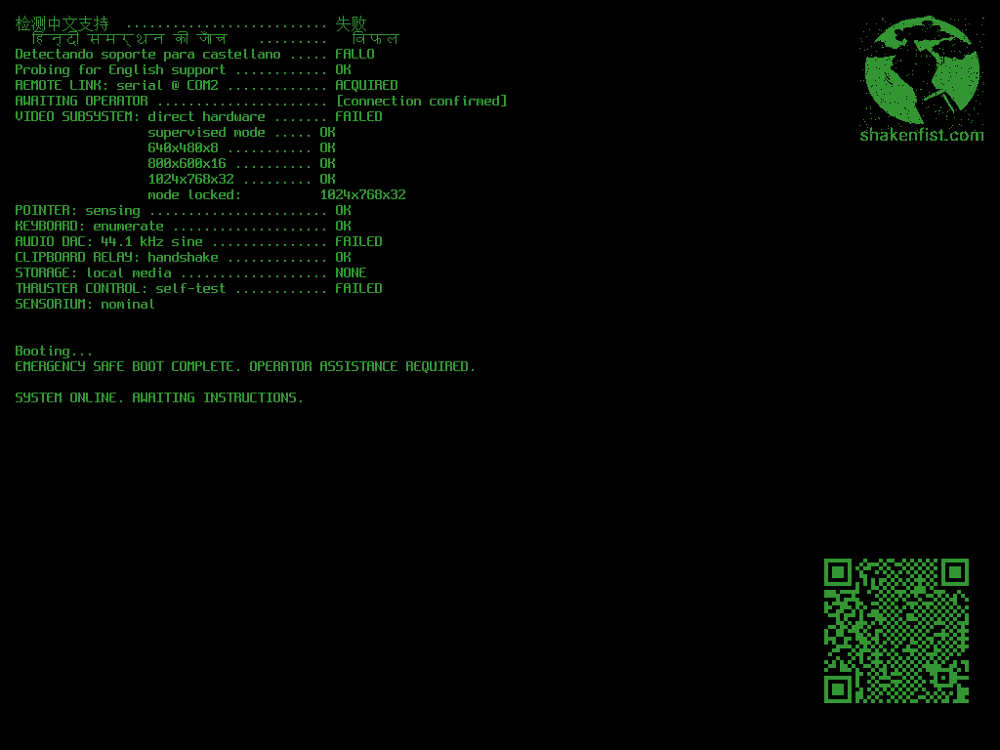

# Uncalibrated Sextant

A small UEFI Rust binary that boots inside a guest VM and exercises the
SPICE remote-display protocol end-to-end — display, cursor, keyboard,
pointer, audio, clipboard and USB redirection — by being a tiny game
the guest renders to its framebuffer and that a [Ryll](../ryll/)-driven
test harness drives over a serial channel.

The codename is deliberate: a sextant that needs calibrating is exactly
what a SPICE channel under test is — an instrument whose readings you
have to verify before you can trust them.

## Status

The first-playable milestone, the locked-bootloader scene (Phase 2
of the locked-bootloader milestone), the display-mode keystrokes
milestone, and the visual on-screen digest milestone have landed.
The binary runs the
full scene state machine — a wordless lone-cursor "awaiting" screen, a
scripted boot sequence with the locked-bootloader sub-scene, and a
SYSTEM ONLINE parking screen — with blinking cursor, LFSR-driven glitch
substitution, and the Shaken Fist logo rendered as a tiled 8x16 glyph
grid in the top-right corner. The opening beats probe for Mandarin /
Hindi / Spanish / English language support (the three non-English probes
report failure in their own scripts, English OK), establishing that
English is no longer the default in the fictional universe. The
bottom-right of the framebuffer carries a QR code that encodes the
most-recent ring-buffer events plus a CRC32C of the rest of the
screen; an external decoder (e.g. ryll) can read this from a
screenshot to validate the display path independently of serial.
On final shutdown, the event ring buffer is drained to the UEFI
Serial protocol as plain text, groundwork for the eventual
gRPC-over-serial transport. See [DESIGN.md](DESIGN.md) for the
channel mapping and two-channel test architecture, and
[docs/visual-digest-format.md](docs/visual-digest-format.md) for the
QR wire format.

## What it looks like



The parking-screen frame after a keypress through the boot
sequence, captured by `make screenshot` and regenerated on demand.

## Building and running

```
make qemu            # build, assemble ESP, launch interactive QEMU window
make spice           # build, assemble ESP, launch QEMU with SPICE + remote-viewer
make release         # produce dist/uncalibrated-sextant.{img,qcow2}
make release-verify  # headless boot check of both release artifacts
make screenshot      # regenerate docs/images/boot-sequence.png via QMP
make digest-payload-smoke  # headless boot, decode parking-screen QR, assert TLV
make vendor-probes   # regenerate src/probes.rs from the vendor script
make build           # build the UEFI binary only (Docker, no host toolchain)
make clean           # remove dist/, target/, and the named Docker volume
```

`make qemu` is the primary interactive target. It opens a GTK window;
press any key to exit cleanly via ACPI shutdown.

### Running under SPICE

`make spice` builds the binary, launches QEMU with a SPICE server on
`127.0.0.1:5900`, and auto-spawns `remote-viewer` to attach. This
confirms the SPICE Display and Inputs channels work end-to-end against
the binary; it is the required launch path for any scene that exercises
a SPICE channel rather than QEMU's bare GTK display.

If `remote-viewer` is not installed, the script exits with a clear
hint — install it with `sudo apt install virt-viewer`.

**Exit gesture: Ctrl-C in the terminal.** There is no QEMU-owned
window in this configuration — closing the `remote-viewer` window does
not stop QEMU. Always exit via Ctrl-C in the terminal that launched
`make spice`; the script's trap will kill both QEMU and `remote-viewer`
cleanly. This is the opposite of the instinct from `make qemu`.

If port 5900 is already in use, override with
`SPICE_PORT=5901 make spice`.

### Locked-bootloader scene

The locked-bootloader scene plays mid-boot, between the
`SENSORIUM: nominal` telemetry line and `EMERGENCY SAFE BOOT
COMPLETE`. It is the first scene that exercises SPICE clipboard
paste as a real channel test.

**Operator UX.** The scene opens with two telemetry lines
establishing a diegetic failure (`Advanced b64 cryptographic
coprocessor: OFFLINE` and `NIST 800-53 SC-28(1) Secret hardening:
DISABLED BY CONFIGURATION`), then presents a three-option prompt:

```
Decryption of next-stage bootloader failed. (R)etry, (I)gnore, or (A)bort?
```

- **(R)etry** — plays an animated `Retrying decryption........`
  leader (eight dots, 200 ms each), then re-renders the prompt
  in place with an attempt counter `(attempt N)`. After five
  retries a sticky note appears: `Continued retry will not change
  the outcome.`
- **(I)gnore** — advances to the blob screen.
- **(A)bort** — cold-resets the VM; the run replays from firmware.

**Blob screen.** Selecting Ignore shows the encoded payload:

```
c2V4dGFudHtIRUxMT19PUEVSQVRPUn0=
```

Decode it externally (`echo c2V4dGFudHtIRUxMT19PUEVSQVRPUn0= | base64 -d`
gives `sextant{HELLO_OPERATOR}`) and paste the decoded value back
to continue boot.

**Canonical client: ryll, not remote-viewer.** `remote-viewer`
cannot deliver a clipboard paste as Inputs-channel keystrokes
when no guest-side vdagent is present. Use `make spice-ryll`,
which spawns ryll with `--enable-paste-as-keystrokes`.

**Paste shortcut: `Ctrl+Alt+V`.** This is ryll's paste-as-keystrokes
shortcut. Do **not** use `Ctrl+Shift+V` — that is the obvious
first guess (matching most terminal emulators) but it is not what
ryll binds, and the keystrokes will arrive at the guest as literal
Ctrl+Shift+V rather than triggering paste. The *Menu → Paste*
option in ryll's UI always works and avoids the keyboard-mapping
question entirely (useful on Mac keyboards where Option/Alt mapping
depends on the keymap layer).

**Four flow paths:**

- **Correct paste** — `Booting...` appears, boot continues through
  `EMERGENCY SAFE BOOT COMPLETE` to the parking screen.
- **Wrong paste** — the input line re-renders in place with
  `(wrong, attempt N of 3)`; after three wrong pastes the
  visible countdown begins immediately.
- **Abort** — cold reset; the VM restarts and the scene replays
  from the beginning.
- **Timeout** — after 60 s of silence at the paste prompt a
  visible countdown appears (`Awaiting decoded payload. Aborting
  in NN...`, counting from 30 to 00 at 1 Hz), then
  `BOOTLOADER UNRECOVERABLE. SHUTTING DOWN.`, then ACPI shutdown.

### Display-mode keystrokes

The following keys switch the GOP framebuffer to a specific resolution
at any time — from the awaiting screen, during booting, or from the
parked screen:

| Key | Resolution  |
|-----|-------------|
| `1` | 640×480     |
| `2` | 800×600     |
| `3` | 1024×768    |
| `4` | 1280×720    |
| `5` | 1280×1024   |
| `6` | 1920×1080   |
| `0` | Cycle through every available mode, ~1 s per mode (interruptible) |

After each switch a brief toast appears on the bottom row naming the
applied resolution (e.g. `mode 1024x768`). If the firmware does not
expose the exact requested mode the nearest available mode is used
instead and the toast shows the substitution form (`requested 1280x720
-> using 1024x768`). The renderer's font is ASCII-only, so the toast
renders exactly as shown — no Unicode `×` or `→`. Under default OVMF +
QEMU all six bindings resolve exactly
— no substitutions are needed — but a future host or `-vga` variant
may differ.

Key `0` walks every mode the firmware exposes with a one-second dwell
per step. Pressing any key during the walk stops the cycle; if the
interrupting key is itself a mode key (`1`–`6`), the walk stops *and*
that resolution is applied.

**Bootloader carve-out.** Mode keys are silently ignored inside the
locked-bootloader R/I/A prompt and paste-prompt loops; those scenes own
their own key handling. Pressing `1` at `(R)etry, (I)gnore, or (A)bort?`
logs the keypress and does nothing — the mode does not change. Mode
keys resume their normal meaning once the bootloader scene completes.

**Acceptance test path.** `make spice-ryll` against ryll's
`display-mode-ui` branch is the canonical test for ryll window-tracking
behaviour. With ryll's *Obey guest size hints* hamburger toggle on (the
default), ryll's window refits to each new resolution. With the toggle
off, ryll's window stays pinned while the binary's scene resizes inside
it — allowing edge-case testing of toggle-off → mode-change → toggle-on
round trips and maximised-window behaviour.

Host dependencies for `make qemu` and `make release`: `qemu-system-x86_64`,
`ovmf`, and `qemu-utils` (for `qemu-img`). Docker remains the only
dependency for `make build` alone.

## Contributing

Install the hooks once:

```
pre-commit install
```

Run the full suite against all files:

```
pre-commit run --all-files
```

Auto-fix rustfmt and clippy warnings in one step:

```
./scripts/check-rust.sh fix
```

Contributor-side dependencies are Docker (for the Rust checks) and
`pre-commit` itself. No host Rust toolchain is required.

## Why a UEFI binary

Booting an entire OS to test a remote-display protocol is unpredictable
and slow. UEFI gives us a deterministic pre-OS environment with direct
access to the firmware's Graphics Output Protocol, Simple Pointer
Protocol, Simple Text Input Ex Protocol, and Serial I/O Protocol — all
the surfaces SPICE actually delivers events into — without an OS in the
way. The companion project [uefi-latency-guest](../uefi-latency-guest/)
takes the same approach for latency probing and is intentionally
minimal; uncalibrated-sextant is the rich counterpart that asks "did
every channel work *correctly*", not just "did the path work at all".

## Why a game

Two reasons. First, a diegetic harness exercises SPICE channels in
combinations that synthetic tests don't think to try (a cursor sprite
changing over a hotspot is the cursor channel under realistic load,
not a unit test for the cursor channel). Second, when something
breaks, "the sword cursor doesn't change to a hand over the door" is
instantly obvious to a human reviewing a screenshot — far more so than
a hash mismatch in a log. Fun is a side benefit; debuggability is the
load-bearing reason.

## Sibling projects

- [ryll](../ryll/) — drives the test harness, parses serial events,
  asserts outcomes
- [kerbside](../kerbside/) and
  [kerbside-patches](../kerbside-patches/) — the SPICE proxy layer
  under test
- [uefi-latency-guest](../uefi-latency-guest/) — the minimal latency
  probe; this repo is its richer cousin
- [instar](../instar/) — source of the gRPC-over-serial transport
  pattern we plan to lift
